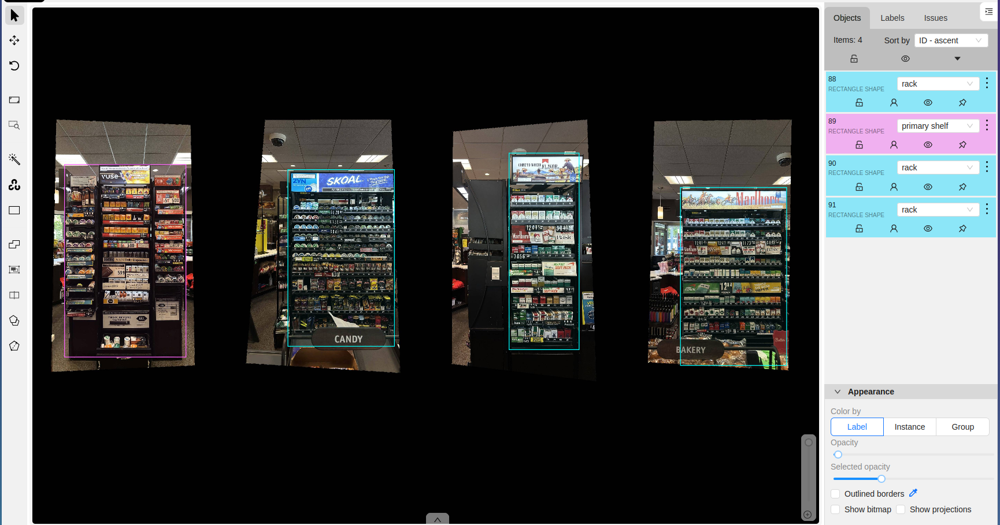
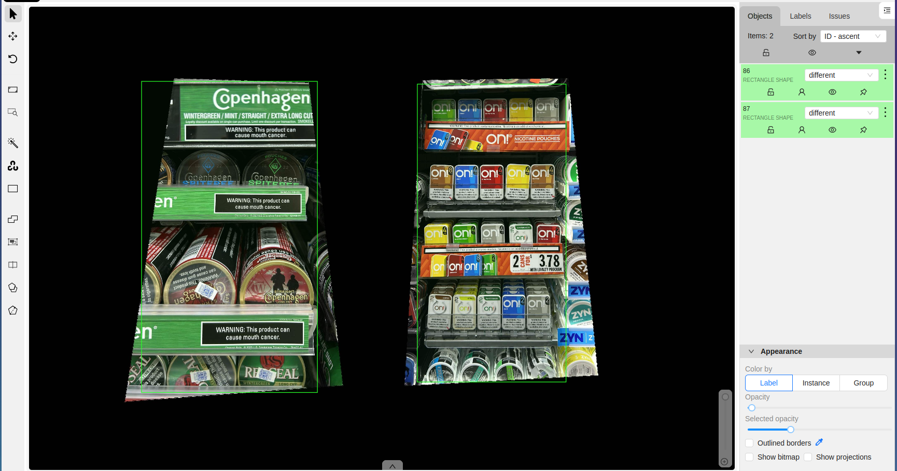

# 🗂️ Dataset Labeling Demo – Retail Shelves

This project demonstrates how to create and export labeled datasets for computer vision tasks using **CVAT**.
I annotated a set of retail shelf images and exported them into **YOLOv8** and **COCO** formats.

---

## 📌 Project Overview
- **Task:** Object detection dataset creation
- **Tool:** [CVAT](https://cvat.ai/)
- **Images Labeled:** 50+ retail shelf screenshots
- **Classes:**
  - `rack`
  - `primary shelf`
  - `different`

---

## 🛠️ Workflow
1. Imported raw retail shelf images into CVAT.
2. Labeled bounding boxes for `rack`, `primary shelf`, and `different`.
3. Exported dataset in two formats: **YOLOv8** + **COCO JSON**.
4. Validated exports by loading into **Ultralytics YOLOv8**.

---

## 📂 Repo Structure
- /images        → Sample raw images
- /labels        → CVAT project files
- /exports/annotations_yolo/ → YOLO format annotations (.txt)
- /exports/annotations_coco/ → COCO format annotations (.json)
---     
### Example Labeled Images
Below are a few screenshots of the annotations created in CVAT:

---

## 🚀 Why This Project?
Creating datasets is a **core skill** in ML/AI workflows.
This demo shows:
- Using professional annotation tools (CVAT).
- Exporting in multiple formats for flexibility.
- Preparing datasets that can directly train models (e.g., YOLOv8).

---

## 🔮 Next Steps
- Add **video annotation demo** (multi-frame bounding boxes).
- Try **Label Studio** for audio/text labeling.
- Scale up to **1000+ labeled images** for production training.

---

## 📧 Contact
If you’re interested in dataset creation, annotation, or model training collaborations, feel free to connect.
